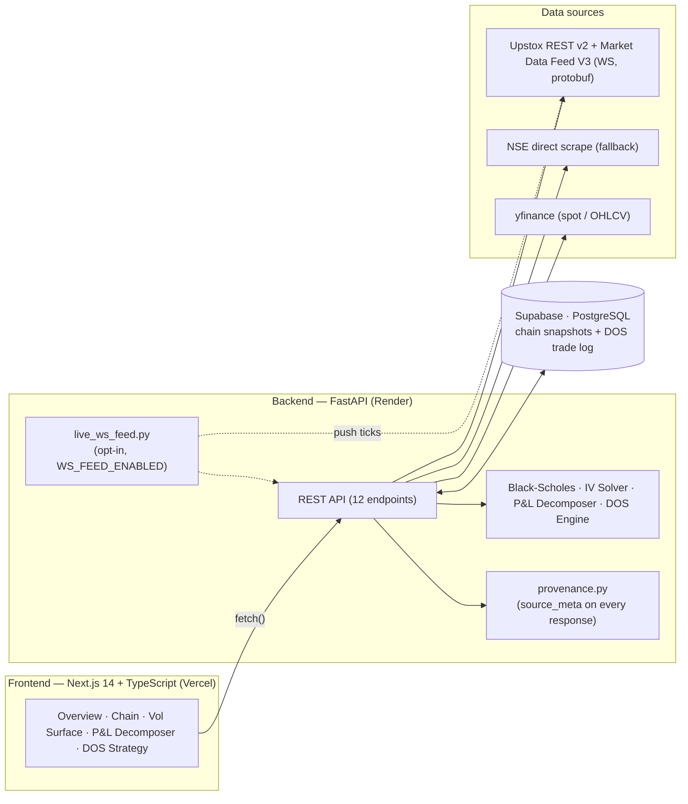
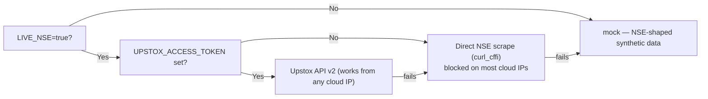

# F&O Derivatives Analytics Platform

**AlgoLabs Assignment 2 &middot; Society of Finance and Investing (SoFI)**

A full-stack platform that pulls live NSE/Upstox derivatives data, prices options and
Greeks via Black&ndash;Scholes, solves implied volatility in reverse, renders the volatility
surface, decomposes position P&amp;L by Greek, explains the option chain in plain
language, and runs a live signal engine + historical backtester for the **DOS
(Direction-of-SuperTrend)** strategy on Bank Nifty weekly-expiry options.

[](backend/tests)
[](backend)
[](frontend)
[](#deployment)

**Live app:** [fnoderivativesanalyticsplatform.vercel.app](https://fnoderivativesanalyticsplatform.vercel.app) &nbsp;|&nbsp;
**API:** [fando-derivatives-analytics-platform.onrender.com/api/health](https://fando-derivatives-analytics-platform.onrender.com/api/health) &nbsp;|&nbsp;
**📄 One-pager report:** [`docs/ONE_PAGER.pdf`](docs/ONE_PAGER.pdf)

---

## Architecture



**Fallback ladder for the option chain** — every response is honest about which rung actually served it (see [Data provenance](#data-provenance)):



---

## Tech Stack

| Layer | Technology | Role |
|---|---|---|
| Frontend | Next.js 14 (React 18) + TypeScript, Tailwind CSS, Recharts, Plotly.js | Option chain UI, P&L/interpretation cards, 3D vol surface, DOS panel |
| Backend | FastAPI (Python), Uvicorn | REST API, Greeks engine, IV solver, P&L decomposer, DOS engine |
| Live data | Upstox API v2 (REST) + Market Data Feed V3 (WebSocket, protobuf), NSE scrape fallback, yfinance | Option chain, spot price, real-time ticks |
| Database | Supabase (PostgreSQL) | Chain snapshot cache, DOS trade log |
| Math | NumPy, pandas, SciPy (Brent's method) | BSM pricing, IV solving, Greeks, SuperTrend |
| Deploy | Vercel (frontend), Render + `render.yaml` (backend) | Hosting |
| Testing | pytest | 30 tests across 6 files |

> The assignment brief's suggested stack lists plain React + D3.js — this project uses
> Next.js (React under the hood, plus SSR/routing) and Recharts/Plotly.js instead, for a
> more batteries-included dev experience without changing anything about *what's*
> computed or displayed.

---

## Feature coverage against the brief

| Requirement | Status | Where |
|---|:---:|---|
| Live option chain — OI, LTP, IV per strike | ✅ | `/api/chain`, `upstox_chain.py` |
| Greeks (Delta/Gamma/Theta/Vega) via BSM | ✅ | `black_scholes.py` |
| IV solver (reverse BSM, Brent's method) | ✅ | `iv_solver.py` |
| Volatility surface (3D, strike × expiry) | ✅ | `/api/vol-surface`, `VolSurface3D.tsx` |
| P&L decomposer by Greek | ✅ interactive | `pnl_decomposer.py`, `/pnl` (Index/IV/Time sliders) |
| Plain-language cards (PCR, max pain, IV spike) | ✅ | `interpretation.py` |
| DOS: live SuperTrend signal + strike selector | ✅ | `dos_strategy.py`, `/api/dos/live-signal` |
| DOS: SL monitor (initial + trailing) | ✅ | `/api/dos/sl-status` |
| DOS: backtest ≥4 weeks + equity curve | ✅ (8 weeks default) | `backtester.py`, `/api/dos/backtest` |
| DOS trade log persisted (Supabase) | ✅ | `supabase_client.py`, `persist=true` |
| DOS interpretation card per trade | ✅ | `interpretation.py` |
| Deployed, working full stack | ✅ | Vercel + Render, links above |

### Engineering beyond the MVP

| Feature | What it does |
|---|---|
| **Real-time WebSocket feed** | Upstox Market Data Feed V3, protobuf-decoded, push-based (vs. REST polling). Opt-in via `WS_FEED_ENABLED`. |
| **Auth-failure parking** | A rejected/expired Upstox token backs off on a long fixed interval instead of retry-storming every ~60s forever. |
| **Data provenance** | Every chain response carries a structured `source_meta` object — which rung served it, capture time, staleness — not just a flat `mock`/`live` string. |
| **Holiday-aware market hours** | The background poller checks NSE's real trading-holiday calendar (Upstox Holidays API), not just weekday + clock window. |
| **Render IaC** | `render.yaml` describes the backend deployment as code. |
| **Frontend keepalive hook** | Pings `/api/health` while the DOS live-signal page is open, to avoid Render free-tier cold starts mid-demo. |
| **Interactive P&L scenario** | `/pnl` lets you drag Index Move %, IV Change, and Time Elapsed and watch the Greek attribution recompute live. |

---

## API Reference

| Endpoint | Method | Purpose |
|---|---|---|
| `/api/health` | GET | Liveness + config flags (mock/live, poller status) |
| `/api/live-spot` | GET | Push-updated spot from the WS feed, if enabled |
| `/api/chain` | GET | Option chain + Greeks for an expiry |
| `/api/vol-surface` | GET | IV surface across strikes × expiries |
| `/api/interpretation` | GET | PCR / Max Pain / IV-spike plain-language cards |
| `/api/pnl-decompose` | GET | P&L attribution by Greek for a scenario |
| `/api/dos/backtest` | GET | Runs DOS across N weeks, returns trade log + stats |
| `/api/dos/history` | GET | Previously persisted DOS trades (Supabase) |
| `/api/dos/live-signal` | GET | Current SuperTrend signal + recommended strike |
| `/api/dos/sl-status` | GET | Initial/trailing SL status for an open position |

---

## What's here

```
backend/app/core/
  black_scholes.py    Vectorized BSM pricer + Greeks (Delta, Gamma, Theta, Vega, Rho)
  iv_solver.py         Reverse-BSM IV solver via scipy.optimize.brentq
  pnl_decomposer.py    Taylor-expansion P&L attribution (Delta/Gamma/Theta/Vega + residual)
  interpretation.py    PCR / Max Pain / IV-spike plain-language cards
  supertrend.py         SuperTrend(period, multiplier) indicator
  dos_strategy.py       DOS signal, strike selection, SL rules (per assignment spec)
  backtester.py         Runs DOS across historical sessions, produces trade log + stats

backend/app/data/
  mock_option_chain.py  NSE-shaped mock option chain + multi-expiry vol surface
  mock_bnf_candles.py   Mock 5-min BNF futures candles (see "Data notes" below)
  live_nse_chain.py     Direct NSE scrape (curl_cffi) -- fallback backend, blocked on most cloud IPs
  upstox_chain.py       Upstox API v2 option chain fetcher -- PREFERRED live backend on a deployed server
  live_ws_feed.py        Real-time WebSocket ingestion (Market Data Feed V3, protobuf) -- opt-in, off by default
  market_hours.py        Weekday + NSE-holiday-aware trading window check
  provenance.py           Structured source_meta (rung, staleness) attached to responses
  data_source.py         Router: picks upstox_chain.py if UPSTOX_ACCESS_TOKEN is set, else live_nse_chain.py

backend/tests/    (30 tests, 6 files)
  test_black_scholes.py    Put-call parity, known BSM value, IV round-trip, Greek sanity checks
  test_upstox_chain.py     Upstox normalizer (mocked response) + data_source routing logic
  test_pnl_decompose.py    P&L attribution correctness, days-elapsed clamp
  test_market_hours.py     Weekend/holiday/clock-window edge cases, API-failure fallback
  test_provenance.py       source_meta shape, staleness threshold
  test_live_ws_feed.py     Auth-failure parking state transitions

excel_report/
  generate_excel_report.py  Builds reports/FnO_Analytics_Report.xlsx (chain+Greeks, vol smile/surface,
                             interpretation cards, P&L decomposition, DOS backtest + equity curve)

backend/main.py
  FastAPI app -- see API Reference above. LIVE_NSE=true switches from mock to
  app/data/data_source.py (see the fallback-ladder diagram above).
  WS_FEED_ENABLED=true additionally starts the real-time WebSocket ingestion.

frontend/
  Next.js 14 + Tailwind + Recharts + Plotly.js. Dark trading-terminal design
  (see "Design system" below). Pages: Overview (/), Option Chain (/chain),
  Vol Surface (/surface), P&L Decomposer (/pnl), DOS Strategy (/dos).

docs/
  ONE_PAGER.pdf  The written one-pager report (deliverable requirement)

render.yaml  Render Blueprint -- backend deployment described as code
```

**Caveat on the DOS module's Wed/Thu cadence**: the assignment brief specifies Bank
Nifty Futures with a weekly Wed/Thu expiry. This code implements that spec exactly
(intentional, for the exercise), but it no longer matches live NSE mechanics as of
July 2026: Bank Nifty weekly options were discontinued in November 2024 (SEBI's
one-weekly-expiry-per-exchange rule), leaving Bank Nifty with only a monthly expiry
on the last Tuesday of the month. Nifty 50's own weekly separately moved from
Thursday to Tuesday effective 1 September 2025. No NSE instrument currently has a
genuine Wed/Thu weekly-expiry cadence — worth flagging in the write-up/viva.

## Run it locally

**Backend:**
```bash
cd backend
pip install -r requirements.txt
python -m pytest tests/ -v          # 30 tests -- validate the pricing/IV/DOS engine first
python -m uvicorn main:app --reload --port 8000
```

**Frontend** (separate terminal):
```bash
cd frontend
npm install
cp .env.local.example .env.local    # NEXT_PUBLIC_API_BASE=http://localhost:8000
npm run dev
```
Open http://localhost:3000 — Overview, Option Chain, Vol Surface, P&L
Decomposer, and DOS Strategy pages, all backed by the live FastAPI endpoints
(currently serving mock NSE-shaped data unless `LIVE_NSE=true`, see below).

## Data provenance

Every `/api/chain` response carries a `source_meta` object alongside the flat
`data_source`/`live_fetch_error` fields it always had:

```json
{
  "data_source": "mock",
  "source_meta": {
    "rung": "mock",
    "description": "Synthetically generated, NSE-shaped mock data",
    "captured_at": "2026-07-24T10:15:00+05:30",
    "age_seconds": 0.3,
    "stale": false,
    "degraded": false,
    "live_fetch_error": null
  }
}
```

## Data notes (read before the viva)

- **Option chain**: mocked with NSE-matching field names (`strikePrice`,
  `openInterest`, `lastPrice`, `impliedVolatility` conceptually — flattened
  here to `strike`, `open_interest`, `last_price`, `implied_volatility`).
  Live data comes from Upstox's API v2 (`app/data/upstox_chain.py`) when
  `UPSTOX_ACCESS_TOKEN` is set — NSE's own API blocks/rate-limits most
  cloud-provider IPs (including Render's), so Upstox is the backend that
  actually works once deployed; `live_nse_chain.py` stays in the codebase as
  a fallback for local/non-cloud runs. Both normalize to the exact same flat
  schema, so nothing in `app/core/` changes either way.
- **Implied volatility is solved, not trusted from the feed**: `/api/chain`
  runs every row's `last_price` back through our own reverse-BSM solver
  (`app/core/iv_solver.py`, Brent's method) via `main._apply_iv_solver`, and
  uses the solved sigma (not the feed's own IV field) for the Greeks shown.
  Falls back to the feed's IV only where Brent's method can't bracket a root.
- **DOS backtest**: NSE's live option-chain API is a snapshot only, and the
  Bhav Copy is end-of-day only — neither has 5-min intraday history for BNF
  futures. The backtester runs against **statistically realistic mock 5-min
  candles** (correct trading hours, correct intraday vol) so the SuperTrend/
  DOS logic is fully built and testable now. For a real backtest, source
  5-min BNF futures history from a vendor (Kite Connect historical API,
  Global Datafeeds) and feed it into `run_backtest()` unchanged.
- **Bhav Copy's actual role**: since Bhav Copy is EOD-only it can't drive the
  intraday signal, but a market-close exit's premium IS an end-of-day price.
  `/api/dos/backtest?use_bhav_copy=true` opportunistically looks up the real
  settlement premium for each market-close exit (`app/data/live_bhav_copy.py`
  `fetch_settle_price`) and prefers it over the flat-IV BS estimate when a
  matching contract row is found.
- **Backtest option pricing**: since no historical options premium feed
  exists either, the sold CE/PE premium is priced via the same BSM engine at
  a flat assumed IV (14%) — stated explicitly rather than hidden.
- **Assumptions stated in the one-pager**: same-day (0DTE) expiry for both
  Wed and Thu sessions, BNF lot size 15, risk-free rate 6.5%.

## Validation performed

- Put-call parity identity holds to 1e-8.
- Matches Hull's textbook BSM example (S=42, K=40, r=10%, σ=20%, T=0.5y → C≈4.76).
- IV solver round-trips: price → solve IV → recovers input σ to 1e-4.
- Deep ITM/OTM delta sanity (→1 / →0).
- Excel workbook has zero formula/calculation errors (verified via LibreOffice recalc).
- Full backend suite: **30/30 tests passing** (`cd backend && pytest tests/ -v`).

## Design system (frontend)

Dark trading-terminal aesthetic, deliberately not the generic "AI cream" or
"acid-green" look: bg `#0B0F14`, cards `#12171F`, borders `#1F2733`, text
`#E6EDF3`, bullish/call `#34D399`, bearish/put `#F87171`, one interactive
accent `#6366F1` kept separate from the sentiment colors. Space Grotesk for
headers, Inter for body, JetBrains Mono for every number (strikes/Greeks
align like a real terminal). Signature element: the ATM Greek gauges on the
Overview page, styled after the FnO deck's own "Risk Dashboard" gauge icons.

## Deployment

| Service | Platform | Config |
|---|---|---|
| Frontend | Vercel | `NEXT_PUBLIC_API_BASE` → Render backend URL |
| Backend | Render (free tier) | `render.yaml`, env vars: `LIVE_NSE`, `UPSTOX_ACCESS_TOKEN`, `WS_FEED_ENABLED`, `SUPABASE_URL`, `SUPABASE_KEY` |
| Database | Supabase | `supabase/schema.sql` |

None of the opt-in flags (`WS_FEED_ENABLED`, `LIVE_NSE`) change any existing
endpoint's behavior when left at their default (`false`) — see each module's
docstring for the fail-safe contract.

## Deliverables checklist

- [x] GitHub repository, clean commit history, this README
- [x] Working full-stack application, deployed (Vercel + Render)
- [x] Written one-pager report — [`docs/ONE_PAGER.pdf`](docs/ONE_PAGER.pdf)
- [x] Every dashboard feature (incl. DOS strategy) explainable end-to-end for the viva — see [Data notes](#data-notes-read-before-the-viva) and the one-pager's caveats section
